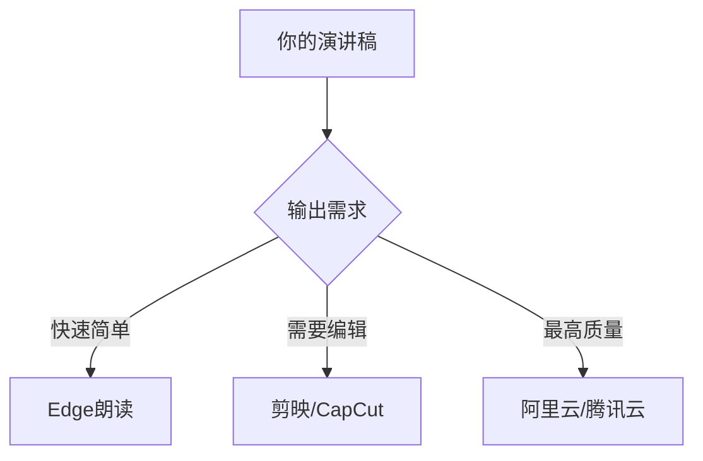

以下是几款完全免费的AI配音工具，适合为你的小组作业视频生成专业演讲稿配音（附操作指南）：

---

### **1. Microsoft Edge 内置"朗读"功能（最简单）**
**特点**：
- 完全免费，无需安装额外软件
- 支持中文/英文等多种语言
- 提供10+种自然语音（包括年轻女声、成熟男声等）

**操作步骤**：
1. 用Edge浏览器打开任意网页或新建空白页
2. 按 `F12` 打开开发者工具 → 选择"朗读"选项卡
3. 粘贴你的演讲稿文本 → 选择"中文-Yunxi"等声音
4. 点击"开始朗读" → 用OBS等录屏软件录制声音

**优势**：零门槛，适合应急使用

---

### **2. 剪映（CapCut）国际版 - 文本转语音**
**特点**：
- 免费提供30+种AI语音（含中英文双语）
- 可调节语速/语调
- 直接导出MP3音频

**操作流程**：
1. 下载"CapCut"（国际版剪映）
2. 新建项目 → 点击"Text" → 输入演讲稿
3. 点击"Text-to-Speech" → 选择"Chinese - Female 01"等
4. 导出音频后与PPT视频合成

**推荐声音**：
- 中文解说：`晓晓（自然）` / `云健（新闻腔）`
- 英文解说：`Jenny（美式）` / `Brian（英式）`

---

### **3. 阿里云语音合成（专业级免费额度）**
**特点**：
- 提供最接近真人的AI语音
- 免费额度：每月5000字符（足够10分钟配音）
- 支持情感化朗读（欢快/严肃/温柔等）

**使用方法**：
1. 访问[阿里云语音合成DEMO](https://ai.aliyun.com/nls/tts)
2. 选择"通用场景" → 试听并选择"知宇/知甜"等声音
3. 输入文本 → 下载生成的MP3

**参数建议**：
```python
语速：-2（稍慢更清晰）
语调：+1（增强表现力）
音量：50（默认即可）
```

---

### **4. Balabolka（离线免费软件）**
**特点**：
- 完全离线的文本转语音工具
- 支持导入TXT/PDF演讲稿
- 可保存为WAV/MP3格式

**安装说明**：
1. 官网下载：https://www.cross-plus-a.com/balabolka.htm
2. 安装时勾选中文语音包（如"Hui"语音）
3. 粘贴文本 → 点击"朗读" → 用"录音机"录制系统声音

---

### **5. 腾讯云语音合成（学生优惠）**
**学生专属福利**：
- 通过教育邮箱认证可获10万字符免费额度
- 提供"新闻主播"专业声线

**申请步骤**：
1. 注册腾讯云账号 → 完成学生认证
2. 进入[语音合成控制台](https://console.cloud.tencent.com/tts)
3. 使用`云小薇（新闻播报风格）`生成配音

---

### **专业级方案（免费+付费）**


**注意事项**：
1. 学术用途建议选择中性语调（避免过于娱乐化的声音）
2. 英文专业术语发音检查：可用[Google文本朗读](https://translate.google.com/)辅助校对
3. 版权声明：建议在视频结尾标注"AI配音仅用于教学演示"

如果需要，我可以帮你将演讲稿按PPT页面对应分段，并标注每段建议的语音语调（如"结论部分使用严肃男声"等）。
